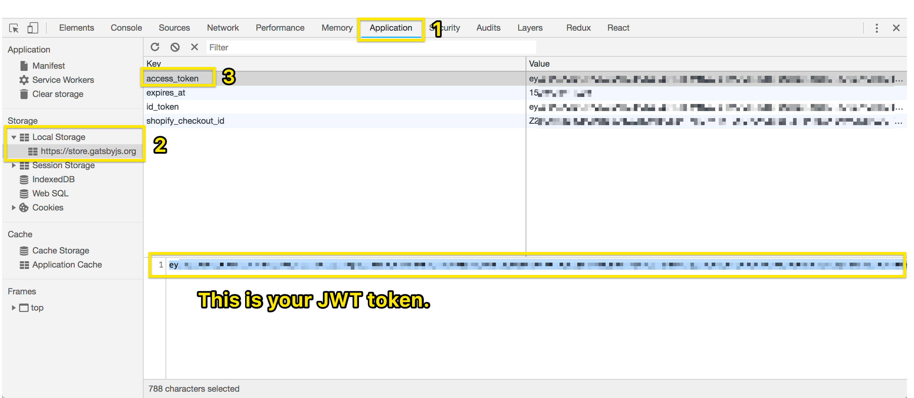

# Gatsby Store API

This is the REST API that powers the Maintainer Dashboard for the [Gatsby Store](https://store.gatsbyjs.org). It handles calls to privileged services such as Shopify and MailChimp to avoid exposing API keys in a client-side app.

## API Reference

### `/store/discount-code`

Whitelists a maintainer to get free swag from the store.

#### Parameters

| Name       | Type   | Description                                                       |
| ---------- | ------ | ----------------------------------------------------------------- |
| username   | String | the GitHub username                                               |
| email      | String | email address (can be any email, but is typically a GitHub email) |
| first_name | String | maintainer’s first name                                           |
| subscribe  | Bool   | `true` if the user wants update via email                         |

> _**NOTE:** All parameters are required._

#### Response

On success (`200`):

```json
{
  "contributor": true,
  "customer": true,
  "subscribed": true,
  "discount_code": "DISCOUNTCODEHERE"
}
```

#### Test this endpoint

Using cURL:

```bash
curl -X POST \
  -H "Content-Type: application/json" \
  -H "Authorization: Bearer [YOUR_JWT_TOKEN]" \
  -d '{"username":"[GITHUB_USERNAME]","email":"[EMAIL]","first_name":"[FNAME]","subscribe":true}' \
  http://localhost:8080/store/discount-code
```

> _**NOTE:** See the ["How to Test This API"](#how-to-test-this-api) section for instructions on getting a JWT token._

## How to Test This API

### Step 1: Start the API locally

```bash
git clone https://github.com/gatsbyjs/api.gatsbyjs.org.git
cd api.gatsbyjs.org
yarn
yarn start
```

### Step 2: Get your access token

To get your JWT token, visit <https://store.gatsbyjs.org> and log in with your GitHub account. Next, open Chrome Developer tools and follow these steps.



1.  Navigate to the "Application" tab
2.  Select `https://store.gatsbyjs.org` under "Local Storage" in the left-hand panel
3.  Select `access_token` in the main panel
4.  Copy the JWT token, which will be a value starting with `ey`

### Step 3: Configure `env` variables

The `.env.EXAMPLE` file contains a list of `env` variables used in various locations throughout the repository. Configure each variable's value per your environment setup and credentials.

| Name                    | Description                                                      |
| ----------------------- | ---------------------------------------------------------------- |
| `APP_LOGLEVEL`          | The debug log output level.                                      |
| `APP_HOST`              | The hostname of the API server.                                  |
| `APP_PORT`              | The port number for the API server.                              |
| `AUTH0_AUDIENCE`        | The unique identifier for your Auth0 API.                        |
| `AUTH0_DOMAIN`          | Your Auth0 domain.                                               |
| `GITHUB_TEAM_ID`        | The GitHub team to which the user should be added.               |
| `GITHUB_TOKEN`          | Your GitHub authentication token.                                |
| `GITHUB_ORG`            | The GitHub organization to search for the user's contributions.  |
| `NODE_ENV`              | The current Node environment in which the API server is running. |
| `SHOPIFY_API_KEY`       | Your Shopify API key.                                            |
| `SHOPIFY_API_SECRET`    | Your Shopify API secret.                                         |
| `SHOPIFY_DISCOUNT_CODE` | The discount code supplied by the Shopify API for the user.      |
| `SHOPIFY_URI`           | The Shopify API domain.                                          |

### Step 4: Send a test request using `cURL`

**IMPORTANT:** Open another terminal. The API needs to still be running.

See the endpoint docs above for [test commands](#test-this-endpoint).
